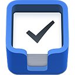

<h1> Send URL to Things3 </h1>

# What is it

This is a tiny extension to send the URL of the active tab to Things3.

It will add the title of the current page as title for the task and put the URL in the notes.

# Prerequisites

- Things3 installed on your machine

# Installation

As I'm not affiliated with [culturedcode](https://culturedcode.com/things/) I won't publish this extension to the store.
This means you will have to add it yourself.

1. Clone the repository
2. `yarn install`
3. `yarn build`
4. [Load unpacked extension into Chrome](https://developer.chrome.com/docs/extensions/mv3/getstarted/#unpacked)

Click the link for a guide on how to add it

# Usage

After installing, you can either click the extension icon or use the shortcut key `Option+P`.

This will automatically open Things3 and prefill the new task with the data.

For every domain you do this, Chrome will ask you if you want to authorize the page to make this action.

# Credit 
Inspired by [kristofferR/add-to-things-3](https://github.com/kristofferR/add-to-things-3) (MV2 extension)

# Contributing 
Feel free to open PRs or raise issues!